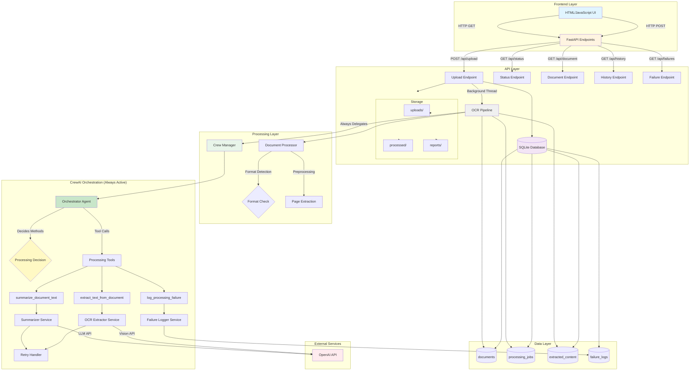
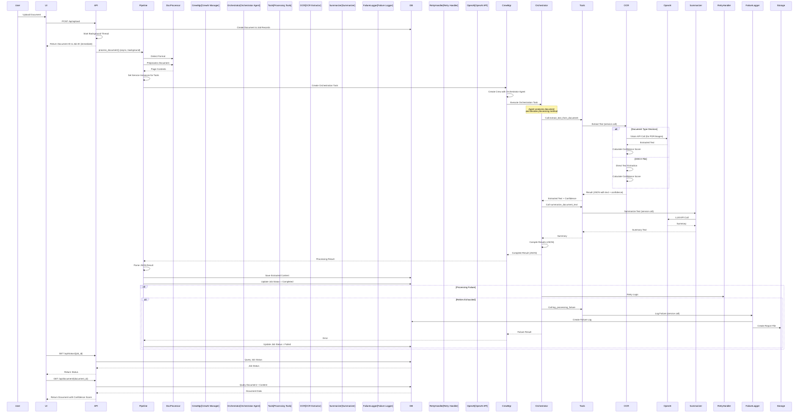
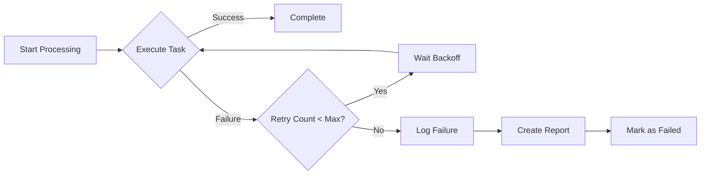

# OCR Pipeline Architecture

## Overview

This document describes the architecture of the OCR Pipeline system, which provides document upload, OCR extraction, summarization, and processing history tracking. The system **always uses CrewAI orchestration** with an intelligent orchestrator agent that decides which processing methods to use based on document characteristics.

## API → Pipeline → CrewAI Flow

**The API directly delegates to CrewAI orchestrator:**

1. **API Upload Endpoint** (`POST /api/upload`):
   - Receives file upload
   - Saves file to disk
   - Creates database records
   - **Starts background thread** that calls `pipeline.process_document()`

2. **Pipeline** (`app/crew/pipeline.py`):
   - Preprocesses document (format detection, page extraction)
   - **Always delegates to CrewAI orchestrator** (no conditional logic)
   - Sets up service instances for CrewAI tools
   - Creates and executes master orchestration task
   - Parses results and saves to database

3. **CrewAI Orchestrator Agent**:
   - **Decides which processing methods to use** based on document characteristics
   - Analyzes file type, size, and complexity
   - Chooses appropriate OCR extraction method (direct for DOCX, OCR for images/PDFs)
   - Determines summarization strategy
   - Handles errors and retries intelligently
   - Uses tools to execute actual processing services
   - Returns structured results to pipeline

**Key Architecture Decision**: The system **always uses CrewAI** with an orchestrator agent that makes intelligent decisions about processing methods. The orchestrator agent has access to all processing tools and decides the best approach based on document characteristics.

## System Architecture

## Data Flow

## Component Details

### 1. Frontend Layer

- **HTML/JavaScript Interface**: Single-page application with drag-and-drop upload
- **Features**: 
  - File upload with progress tracking
  - Document list with status, current stage, and confidence scores
  - Real-time stage tracking during processing:
    - Preprocessing: Format detection and page extraction
    - OCR Extraction: Text extraction via CrewAI orchestrator
    - Summarization: Document summarization
    - Saving Results: Storing extracted content
  - Document detail view with extracted text and summary
  - Auto-refresh for processing status (every 5 seconds)
  - Visual stage indicators with progress percentages

### 2. API Layer (FastAPI)

**Endpoints:**
- `POST /api/upload` - Upload document (returns immediately, processes in background)
- `GET /api/status/{job_id}` - Get job status with current stage information
- `GET /api/document/{document_id}` - Get document with extracted content
- `GET /api/history` - Get processing history with current stage for processing documents
- `GET /api/failures` - Get failure logs for review

**Upload Flow:**
1. File is received and validated
2. File is saved to `uploads/` directory
3. Document format is detected
4. Document and job records are created in database
5. Response is returned immediately with document_id and job_id
6. Background thread starts `pipeline.process_document()` asynchronously

**Key Implementation Details:**
- Upload endpoint returns immediately (non-blocking)
- Processing happens in a background thread (non-daemon)
- Each background thread creates its own event loop and database session
- Errors in background processing are logged and job status is updated

### 3. Database Schema

**Tables:**
- `documents` - Document metadata (filename, file_path, file_type, status, upload_date)
- `processing_jobs` - Job tracking with:
  - Status: pending, processing, completed, failed
  - **Current Stage**: preprocessing, ocr_extraction, summarization, saving_results, failed
  - Retry count
  - Timestamps: created_at, started_at, completed_at
  - Error message
- `extracted_content` - OCR results with confidence scores, raw text, summary, metadata
- `failure_logs` - Failed jobs for human review with error details and review status

**Stage Tracking:**
The `current_stage` field in `processing_jobs` provides real-time visibility into the processing pipeline:
1. **preprocessing**: Format detection and page extraction
2. **ocr_extraction**: OCR extraction via CrewAI orchestrator
3. **summarization**: Document summarization
4. **saving_results**: Saving extracted content to database
5. **failed**: Processing failed (also set in error_message)

### 4. Processing Layer

**Document Processor** (`app/services/document_processor.py`):
- Format detection using MIME types and file extensions
- Preprocessing for OCR:
  - Images (PNG, JPEG, TIFF): Returns raw image bytes
  - PDF: Returns entire PDF file (OpenAI GPT-4o processes PDFs directly - no conversion needed)
  - DOCX: Extracts text directly using python-docx
- Supports: PDF, PNG, JPG, JPEG, DOCX, TIFF

**OCR Extractor** (`app/services/ocr_extractor.py`):
- Text extraction using OpenAI Vision API
- Handles multi-page documents
- Calculates confidence scores (0.0-1.0) using `ConfidenceScorer`

**Summarizer** (`app/services/summarizer.py`):
- Document summarization using OpenAI LLM (gpt-4)
- Creates comprehensive summaries with structured information

**Retry Handler** (`app/services/retry_handler.py`):
- Configurable retry count (default: 2)
- Exponential backoff between retries
- Supports both async and sync operations

**Failure Logger** (`app/services/failure_logger.py`):
- Logs failures to database
- Creates report files in `reports/` directory
- Tracks review status for human review workflow

### 5. OCR Pipeline (`app/crew/pipeline.py`)

The main pipeline orchestrator that coordinates document processing with real-time stage tracking:

1. **Preprocessing Stage** (`current_stage = "preprocessing"`):
   - Format detection using document processor
   - Document preprocessing (page extraction/conversion)
   - Prepares page contents for processing
   - Updates job status to "processing" and stage to "preprocessing"

2. **OCR Extraction Stage** (`current_stage = "ocr_extraction"`):
   - Sets up service instances for CrewAI tools
   - Creates master orchestration task
   - Delegates to CrewAI orchestrator agent
   - Updates stage to "ocr_extraction" before CrewAI execution
   - Orchestrator agent performs OCR extraction

3. **Summarization Stage** (`current_stage = "summarization"`):
   - After OCR extraction completes successfully
   - Orchestrator agent performs document summarization
   - Updates stage to "summarization"

4. **Saving Results Stage** (`current_stage = "saving_results"`):
   - Parses JSON results from orchestrator
   - Validates extracted text and summary
   - Saves results to database
   - Updates job status to "completed" and clears current_stage

5. **Error Handling**:
   - Retry mechanism wraps CrewAI execution
   - On failure: Sets `current_stage = "failed"` and `status = "failed"`
   - Failure logging through CrewAI tools
   - All stage updates are committed to database for UI visibility

### 6. CrewAI Orchestration (Always Active)

**Architecture:**
- CrewAI is **always used** for document processing
- Orchestrator agent makes intelligent decisions about processing methods
- No conditional logic - all processing goes through CrewAI

**Crew Manager** (`app/crew/crew_manager.py`):
- Creates and executes CrewAI crews
- Runs crews in thread pool executor (async interface)
- Handles timeouts (default: 300 seconds)
- Returns structured results to pipeline

**Orchestrator Agent** (`app/crew/agents.py`):
- **Role**: Document Processing Orchestrator
- **Responsibilities**:
  - Analyzes document characteristics (file type, size, complexity)
  - Decides which processing methods to use
  - Chooses appropriate OCR extraction method (direct for DOCX, OCR for images/PDFs)
  - Determines summarization strategy
  - Handles errors and retries intelligently
  - Coordinates all processing steps
- **Tools**: Has access to all processing tools (extract_text_from_document, summarize_document_text, log_processing_failure)
- **Delegation**: Can delegate to specialized agents when needed

**Specialized Agents** (`app/crew/agents.py`):
- **OCR Agent**: Specialized for text extraction (can be delegated to by orchestrator)
- **Summarizer Agent**: Specialized for document summarization (can be delegated to by orchestrator)
- **Supervisory Agent**: Monitors pipeline, handles retries, logs failures

**Master Orchestration Task** (`app/crew/tasks.py`):
- **`create_orchestration_task()`**: Creates the master task that orchestrates entire workflow
- The orchestrator agent executes this task
- Task includes decision-making guidance for the agent
- Expected output: JSON with raw_text, summary, confidence_score, metadata

**Specialized Tasks** (available for delegation):
- OCR extraction task: For focused text extraction
- Summarization task: For focused document summarization
- Supervision task: For failure monitoring and logging

**Tools** (`app/crew/tools.py`):
- `extract_text_from_document`: Wrapper around OCR extractor service
- `summarize_document_text`: Wrapper around summarizer service
- `log_processing_failure`: Wrapper around failure logger service
- Tools receive service instances via `set_service_instances()` before crew execution
- Tools are thin wrappers that call actual service methods

**Key Design Decisions:**
- **Always use CrewAI**: No conditional logic, all processing goes through CrewAI
- **Intelligent orchestration**: Orchestrator agent decides processing methods based on document characteristics
- **Agent-driven decisions**: The agent analyzes documents and chooses the best approach
- **Tool-based execution**: Agents use tools to execute actual services
- **Service injection**: Service instances are injected into tools before execution
- **Structured output**: Orchestrator returns JSON with all processing results

### 7. Retry & Error Handling

- **Retry Handler**: 
  - Configurable retry count (default: 2)
  - Exponential backoff between retries
  - Async support
  - Wraps CrewAI orchestration execution
  - Retries are handled at the pipeline level, wrapping the entire CrewAI execution
- **Failure Logger**: 
  - Logs failures to database
  - Creates report files for human review
  - Tracks review status
  - Called via CrewAI orchestrator agent using `log_processing_failure` tool

### 8. Storage Layer

- `uploads/` - Original uploaded documents (saved by upload endpoint)
- `processed/` - Processed document artifacts (currently unused, reserved for future use)
- `reports/` - Failure reports for human review (created by failure logger)

## Confidence Scoring

The confidence score is calculated based on:
1. **Text Length**: Longer text generally more reliable
2. **Error Patterns**: Detection of common OCR errors
3. **Word Quality**: Ratio of reasonable-length words
4. **Punctuation & Capitalization**: Indicators of good OCR

Score range: 0.0 (low confidence) to 1.0 (high confidence)

## Retry Mechanism

## Module Separation

1. **Presentation Layer** (`frontend/`) - User interface (HTML/JavaScript)
2. **API Layer** (`app/api/`) - REST endpoints and request/response schemas
3. **Business Logic** (`app/services/`) - Core processing services:
   - `document_processor.py` - Format detection and preprocessing
   - `ocr_extractor.py` - Text extraction with confidence scoring
   - `summarizer.py` - Document summarization
   - `retry_handler.py` - Retry logic with exponential backoff
   - `failure_logger.py` - Failure tracking and reporting
   - `storage.py` - File storage management
   - `confidence_scorer.py` - Confidence score calculation
4. **Orchestration** (`app/crew/`) - Pipeline orchestration and optional CrewAI integration:
   - `pipeline.py` - Main pipeline coordinator
   - `crew_manager.py` - CrewAI crew execution
   - `agents.py` - CrewAI agent definitions
   - `tasks.py` - CrewAI task definitions
   - `tools.py` - CrewAI tools wrapping service calls
5. **Data Layer** (`app/database/`) - Database models and operations:
   - `models.py` - SQLAlchemy models
   - `db.py` - Database session management
6. **Configuration** (`app/config.py`) - Centralized settings (Pydantic BaseSettings)
7. **Utilities** (`app/utils/`) - Logging and other utilities

## Technology Stack

- **Backend Framework**: FastAPI (ASGI server: Uvicorn)
- **Database**: SQLite with SQLAlchemy ORM
- **AI/ML**: 
  - OpenAI API (Vision API for OCR, GPT-4 for summarization)
  - CrewAI (optional, for agent-based orchestration)
- **File Processing**: 
  - Pillow (PIL) - Image processing
  - python-docx - DOCX document parsing
  - Note: PDFs are sent directly to OpenAI GPT-4o (no conversion library needed)
- **Frontend**: HTML5, JavaScript (ES6+), CSS3
- **Configuration**: Pydantic Settings for environment-based configuration
- **Async Processing**: asyncio, threading for background processing

